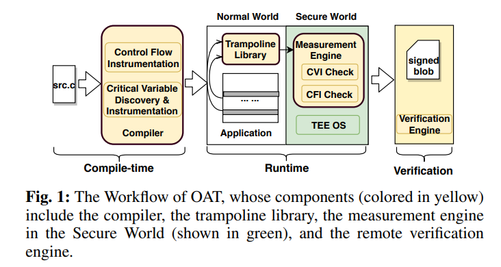

# Prototype for OAT: Attesting Operation Integrity of Embedded Devices

该存储库是我们论文 [OAT：证明嵌入式设备的操作完整性 (Oakland'20)][1] 的原型实现。它包含 OAT 编译器 ( `oat-llvm40`)、OAT Trampoline 库 ( `oat-trampoline-lib`)、OAT 测量引擎 ( `oat-measurement-engine-ta`)、OAT 验证引擎 ( `oat-verify-engine`)、评估示例 ( `oat-evaluation`) 以及一些 OAT 编译器的测试程序 ( `oat-test`)。

OAT 是一个端到端的远程认证系统，允许验证者在证明者（通常是远程部署的嵌入式设备）上证明关键操作的`control-flow integrity`有效性。您可以[在此处](https://www.youtube.com/watch?v=yxS5AoyszP8)`critical data integrity`查看我们的会议演讲。OAT 系统架构如下所示

## Contents

- `oat-llvm40`：基于 llvm-4.0.0 的 OAT 编译器。它用于分析和检测嵌入式应用程序的关键数据和控制流测量。对 llvm 前端的修改位于 下`oat-llvm40/lib/Transforms/`，例如`CFVHints/`和`Nova/`；对 llvm 后端的修改位于 下`oat-llvm40/lib/Target/AArch64/`，例如`AArch64ControlFlowVerification.cpp`和`AArch64ControlFlowVerification.h`。
- `oat-trampoline-lib`：OAT trampoline 库，可以构建为共享库并与被检测的应用程序链接。它依赖于 OP-TEE 客户端库`libteec`。
- `oat-measurement-engine-ta`：OAT 测量引擎，是 TEE 内部运行的可信应用程序 (TA)。将其构建为 OP-TEE TA。
- `oat-verify-engine`：OAT 验证引擎。它使用应用程序的二进制文件和跟踪来验证证明 blob。
- `oat-evaluation`：OAT 评估程序，`-orig`是代码的未修改版本，`-cb`是可供编译/检测的修改版本（带注释）。
- `oat-test`：一些针对OAT编译器的测试程序。测试OAT编译器对instrumentation、annotation和c++代码的支持。

## Requirements

- 在具有足够内存的服务器上安装 OAT-Compiler，因为重新编译 OAT-Compiler 需要大量内存。（OAT-Compiler 基于 LLVM-4.0.0，服务器运行 Ubuntu 16.04。）
- [安装了 Debian 操作系统的HiKey（LeMaker 版本）](https://www.96boards.org/product/hikey/)（HiKey 620）。
- 在 HiKey 板上安装 OP-TEE OS（OP-TEE 2.0）。OP-TEE 以前支持 HiKey 板上的 Debian OS（使用 OP-TEE 2.0），现在仅支持 AOSP。有关更多详细信息，请参阅[此处的旧问题。](https://github.com/OP-TEE/optee_os/issues/1257)
- 在开发服务器（或桌面）上安装OP-TEE OS与TA编译环境，以便在需要的时候可以重新编译TA或TEE OS，参见[TA使用技巧](https://optee.readthedocs.io/en/latest/building/trusted_applications.html)。
- 在 Hikey 板上安装原生 Arm64 gcc 编译器，以在本地编译嵌入式应用程序。

## Workflow

- 准备：给定一个评估程序，选择您想要证明的操作（执行某些关键功能的代码片段），并注释关键变量。
- Trampoline 库：构建 TEE 客户端库和 trampoline 库。
- 编译：在安装了 OAT-Compiler 的服务器上使用 OAT-Compiler 将代码编译为 Arm64 汇编代码，然后编译汇编代码并将其与目标设备（在我们的例子中是 HiKey Board）上预先构建的 trampoline 库链接起来。
- 安装TA：在HiKey Board上编译并安装测量引擎作为OP-TEE TA。
- 在HiKey Board上运行评估程序，确保tee-supplicant已启动，可以呼叫TA。
- 收集证明 blob。为了便于验证，间接分支和条件分支的跟踪被打印到文件中，您可以使用该文件进行验证。
- 验证 blob。使用验证引擎验证证明 blob，还需要评估程序的二进制文件。

## Note

- 评估程序在必要时会被修改（有时会进行定制以保留评估的关键操作），以便它能定期执行操作，模仿远程部署的不间断嵌入式程序。
- 我们不会为该原型签署证明 blob，仅将其存储为安全对象。
- OAT-Compiler 对基于 SoftBound 的指针访问的支持尚未完全实现，目前已被注释掉。
- 每个目录的 Makefile 包含了关于各个部分如何编译和使用的丰富信息。
- 由于这个项目起步较早，我们基于的 OP-TEE 和 LLVM repo 有点旧了。使用此 repo 的另一种方法是将代码移植到较新的版本。
